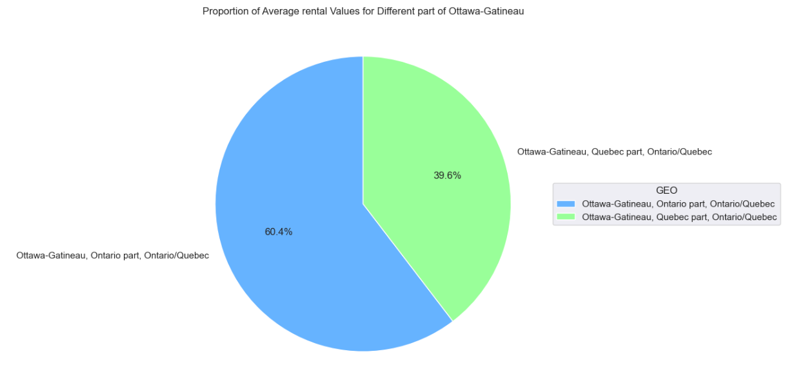
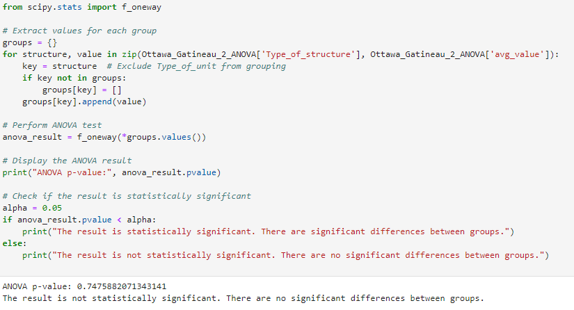

# RentalMarketAnalysis

## Analysis Description:
This analysis provides an in-depth insight into the dynamics of the rental market in the Ottawa-Gatineau region over the past decade. Through a combination of time series analysis, examination of regional disparities, and statistical modeling, we explore the exponential growth of rental prices, changes over time, and the influence of economic factors on the market. Present a forecast for the next five years, offering relevant insights for decision-makers, including investors, legislators, and residents.

## Process

Process |   Notebook |
|:-|:-|
|Data cleaning/wrangling | [Data_cleaning_EDA.ipynb](/Data_analysis.ipynb)|
|Data analysis and visualization|[Data_analysis.ipynb](/Data_analysis.ipynb)|
|Data sets|[Data](/Data/)|

[Row data 1](https://www150.statcan.gc.ca/t1/tbl1/en/tv.action?pid=3410013301&pickMembers%5B0%5D=1.105&pickMembers%5B1%5D=3.1&cubeTimeFrame.startYear=2013&cubeTimeFrame.endYear=2022&referencePeriods=20130101%2C20220101)

[Row data 2](https://www150.statcan.gc.ca/t1/tbl1/en/tv.action?pid=1810000501&pickMembers%5B0%5D=1.2&cubeTimeFrame.startYear=2012&cubeTimeFrame.endYear=2022&referencePeriods=20120101%2C20220101)

## Results

### 1.Provide one or more visualizations that clearly explain how rental costs have changed in the Ottawa-Gatineau area over the last 10 years.

#### Observations:
- The average rent price for Ottawa-Gatineau has been exponentially increasing over the last ten years.
- The average rental price in Ottawa-Gatineau has experienced a remarkable growth of 42.92% from the first to the last year.

#### Observations:
- Slope:47.21. This indicates that, on average, the rental cost has increased by approximately $47.21 dollars per year.

- R-squared:0.938. The linear model explains a significant portion 93.8% of the variance in rental costs over time.

### a) How this change differs between Ontario and Quebec

#### Observations:
- Rental prices has been historically higher in Ontario than Quebec
- The percentage change in rental prices is higher in Quebec (56.71%) than Ontario (40.83%), a 15.88% difference. 
- From 2013 to 2018, there was a steady increase in rental prices in both provinces, with a growth of 5.27% in Quebec and 12.79% in Ontario, respectively.
- From 2018 to 2022, there was a rapid increase in rental prices in both provinces, with growth rates of 48.86% in Quebec and 24.86% in Ontario, respectively.

#### Observations: 
- Ontario:
Slope: 47.78. Rental costs increase in Ontario by approximately $47.78 per year.
R2: 0.916. This model can explain 91.6% of the variance in rental costs over time.

- Quebec:
Slope: 32.65 Rental costs increase in Quebec by approximately $32.65 per year.
R2: 0.717. This model can explain 71.7% of the variance in rental costs over time.

#### Observation:
- When comparing Ottawa-Gatineau, Ontario part, Ontario/Quebec, and Ottawa-Gatineau, Quebec part, Ontario/Quebec, we can observe that the average rental price is higher in Ottawa-Gatineau, Ontario part, by 34.39%.

### b) Visualization(s) that clearly depict how the “Type of Structure” may or may not contribute to different rental pricing.

Based on the graph, we can see that the Type of Structure has a negligible impact on the price change, but it does influence the Type of Unit.

But to be certain for sure, additional statistical tests for significance is required.

In this code, we are conducting an ANOVA (Analysis of Variance) test to determine if there are significant differences in average rental prices among different groups based on the "Type_of_structure" variable. Here's a step-by-step breakdown:

#### Observation: 
-If the p-value is less than alpha, we conclude that there are significant differences between groups. Otherwise, we conclude that there are no significant differences.
The ANOVA p-value is 0.75.
The result is not statistically significant, suggesting that there are no significant differences in average rental prices among the groups based on the "Type_of_structure" variable.

This code is similar to the previous one, but it focuses on the "Type_of_unit" variable. Here's the breakdown:

#### Observation:
-The ANOVA p-value is obtained for the "Type_of_unit" variable. ANOVA p-value is:0.0000000. The result is statistically significant, suggesting that there are significant differences in average rental prices among the groups based on the " Type_of_unit " variable.

### c) How the overall average compares to Toronto, Montreal, and Vancouver areas

Observation:
-In the chart, we can observe that Vancouver, British Columbia, has the highest average rental price, while Montréal, Quebec, has the lowest, compared to the overall average rental price of Ottawa-Gatineau, Ontario/Quebec.

### 2.Provide any additional findings you discovered and found interesting

#### Observations:
-10 years ago, the rental prices between Toronto and Vancouver were very close (a difference of $27.94), 10 years later, that gap has increased to $211.32.
- 10 years ago, the rental prices between Ottawa and Montreal were $229.27 today, that gap has increased to $388.66
- All cities have maintained almost similar growth rate.

### 3.Compare the rent growth to the Consumer Price Index (CPI)

Based on the dataset I found CPI Statistic Canada web page (folder Data), I calculated the percentage changes by years for CPI values. First, I displayed the rental growth over the years in percentages for Ottawa-Gatineau, and then calculated CPI at the level of Canada's price for CPI Rent and CPI All items.

Here is a tabular representation of values that I further visualized with a graph.

#### Observation:
The rent growth rate follows the Consumer Price Index (CPI) for both rent and all items. As the CPI increases, the rent growth rate also increases. Conversely, when the Consumer Price Index decreases, the rent growth rate decreases. In 2019, during the pandemic, both the rent growth rate and the Consumer Price Index decreased.

I calculate the data using the same principle as for the CPI shown above for all of Canada CPI (Rent and All-items), but here I also calculate and include the CPI for rent for Ontario and Quebec.

#### Opservation:
Historically, the Consumer Price Index (CPI) for rent in Ontario has always been higher than that in Quebec. In 2021, it fell below, but corrected in 2022.

### Forcasting 

The graph below depicts a time series analysis utilizing the ARIMA (Autoregressive Integrated Moving Average) model to forecast average rent values in Ottawa-Gatineau for the next 5 years. It provides a visual representation of historical rent values and forecasts, facilitating the observation of trends and potential future changes.

#### Opservation:
On the graph, we can observe the trend of exponential growth in the average rental price for Ottawa-Gatineau over the years. We can also see the forecasted increase in prices for the next 5 years. It is evident that the expected price increase in five years will likely be around 22.29%.

